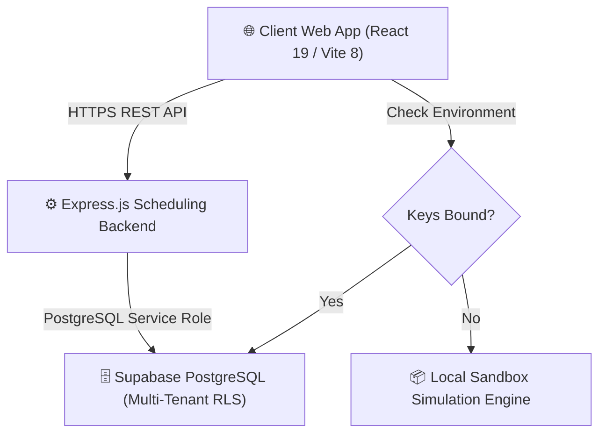

# 🌌 Ambience TutorsFlow™ — Version 1.0 Release Candidate
### Soli Deo Gloria — Glory to God the Father, God the Son, and God the Holy Spirit.

**Ambience TutorsFlow™** is an elite, multi-tenant, commercial SaaS learning ecosystem designed for independent tutors, parents, students, learning centers, and school organizations. It integrates cutting-edge pedagogical AI assistance, seamless Zoom classroom scheduling, and strategy-pattern Billing/Subscriptions under a premium dark glassmorphic interface.

---

## 🎨 Immersive User Interface & Core Modules

The platform is designed around four specialized dashboards, each audited for responsiveness, accessibility, and visual consistency:

1. **Student Workspace**: 
   - **Socratic AI Homework Assistant**: Sequential step-by-step mathematical guides, accordion hints, and hand-written image uploads.
   - **AI Study Vault**: Subject-indexed revisions explorer with concept mastery gauges.
   - **Interactive Calendar**: Conflict-free tutoring booking and Zoom lesson launcher.
2. **Tutor Workspace**:
   - **AI Lesson Planner**: Virtual-aligned lesson structures mapped with Grit, Perseverance, Integrity, and Diligence.
   - **AI IEP Goal Planner**: Measurable SMART objectives, clinical accommodations, and progress recorders.
   - **AI Tutor Copilot™**: Real-time study aids covering 11 subjects (Bible Study, SAT, ACT, math, and sciences).
3. **Parent Portal Workspace**:
   - **AI Parent Copilot™**: Real-time home-coaching assistants, progress reviews, and summaries.
   - **Character Growth Ledger**: Virtues audit cards, attendance checklists, and printable receipts.
4. **Administrator Intelligence Command**:
   - **SaaS Telemetry Dashboard**: Real-time tracking of MRR, ARR, active subscriber growth ratios, user churn, and billing metrics.
   - **System Audits Center**: Unified tenant audits, RLS status, and server rate-limiting views.

---

## 🚀 Key Version 1.0 Launch Candidate Innovations

- **Universal Database Search Modal**: A federated, clientside search index mapped to 9 primary database tables (Students, Tutors, Parents, Bookings, Homework, Lesson Plans, Invoices, Messages, and Reports) in real-time.
- **Interactive Notification Center**: Dropdown alert center tracking 8 core event categories (Message receipts, payment approvals, lesson bookings, homework deadlines) with dynamic status-color coding and read indicators.
- **Keyboard-Escape ADA Controls**: ADA-compliant tab focuses (`*:focus-visible` halos), semantic landmark tags, screen-reader details, and instant Escape key binds for search/notification controls.
- **Perfect Mobile Responsiveness**: Fluid columns, scrollable flat-tab headers, minimum touch targets (`44px` height), and zero margin overflow.

---

## 🏗️ Technical Architecture & Dual-Mode Capability

Ambience TutorsFlow™ features a robust, zero-configuration dual-mode execution strategy:



- **Production Mode (Live)**: Syncs state directly with Supabase PostgreSQL, enforcing strict Row-Level Security (RLS) rules and validating JWT session tokens.
- **Simulation Mode (Offline Fallback)**: Automatically activates if environment variables are absent. Runs entirely clientside using localized memory states, allowing immediate mock evaluation.
- **Zero-Dependency Rate Limiter**: Guarded backend Express endpoints cap heavy traffic at 15 req/min.

---

## 🔧 Installation & Verification

### Prerequisites
- Node.js (v18 or higher)
- npm (v9 or higher)

### Setup Directory
Clone the repository and initialize node dependencies:
```powershell
# Install frontend assets
cd frontend
npm install

# Install backend configurations
cd ../backend
npm install
```

### Local Execution (Simulation Mode)
To run the platform locally in offline evaluation mode:
```powershell
# Launch backend server on Port 5000
cd backend
npm run dev

# Launch React frontend (Vite) on Port 5173
cd ../frontend
npm run dev
```

### Production Build Validation
Confirm build stability before staging:
```powershell
# Validate frontend static compile
cd frontend
npm run build

# Validate backend parsing integrity
cd ../backend
node -c server.js
```

---

## 📂 Project Documentation Map

Explore our detailed project resources:
- **Project Specifications**: [PROJECT_STATUS.md](file:///D:/Ambience-TutorsFlow/PROJECT_STATUS.md) | [Product-Roadmap.md](file:///D:/Ambience-TutorsFlow/docs/00-Project/Product-Roadmap.md)
- **Phase 15 Release Notes**: [README.md](file:///D:/Ambience-TutorsFlow/docs/Phase-15/README.md) | [PHASE_15_COMPLETION_REPORT.md](file:///D:/Ambience-TutorsFlow/docs/Phase-15/PHASE_15_COMPLETION_REPORT.md)
- **Architecture & Business**: [SaaS_Model.md](file:///D:/Ambience-TutorsFlow/docs/Business/SaaS_Model.md) | [Pricing.md](file:///D:/Ambience-TutorsFlow/docs/Business/Pricing.md)
- **Deployment & Scaling**: [README.md](file:///D:/Ambience-TutorsFlow/docs/Deployment/README.md)

---

Soli Deo Gloria — Glory to God the Father, God the Son, and God the Holy Spirit.
