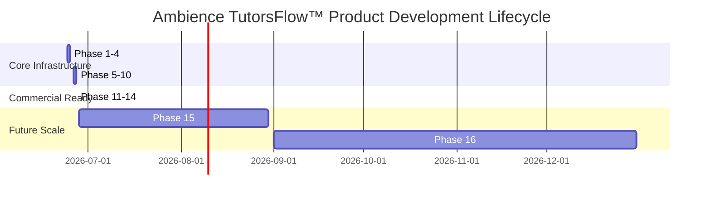

# Product Roadmap — Ambience TutorsFlow™
### Soli Deo Gloria — Glory to God the Father, God the Son, and God the Holy Spirit.

This roadmap outlines the long-term vision, core milestones, and future functional phases for Ambience TutorsFlow™.

---

## 📅 Roadmap Overview

---

## 1. Completed Milestones (Phases 1–14)

* **Phase 1–5 (Foundation & Database Sync)**:
  - Designed responsive React frontend and Express backend.
  - Completed native Zoom OAuth scheduling automation.
  - Linked database tables directly to Supabase multi-tenant PostgreSQL.
* **Phase 6–10 (AI Pedagogical Suite)**:
  - Deployed localized AI Assistants (Lesson Planner, IEP Assistant, Tutor Copilot, Parent Copilot).
  - Built diagnostic SAT/ACT test builders and automated performance recorders.
  - Configured multi-tenant communication centers and shared notes systems.
* **Phase 11–14 (Commercial SaaS & Subscriptions)**:
  - Redesigned public pricing sections into Student, Tutor, and Institutional tiers.
  - Launched the unified **My Plan** billing page tracking real-time resource limits.
  - Upgraded the Socratic AI Homework Assistant and launched the **AI Study Vault** archiver.
  - Created an administrative **SaaS Telemetry Cockpit** (MRR/ARR metrics).

---

## 2. Upcoming Milestones (Phases 15+)

### Phase 15: Regional Scale & Advanced LMS Integration (In Progress)
* **Goal**: Expand support for large-scale learning networks and multi-academy trusts.
* **Key Targets**:
  - Live Canvas and Blackboard LTI 1.3 deep-linking connectors.
  - Granular administrative role permissions (District Admins, School Admins, Department Chairs).
  - Geographic hosting zones to comply with international data localization rules.
  - Custom AI fine-tuning capabilities utilizing school-specific curricula.

### Phase 16: Native Mobile Applications & Offline Synchronization
* **Goal**: Deeper student engagement and home learning support.
* **Key Targets**:
  - iOS and Android apps utilizing React Native or Flutter.
  - Offline-first database synchronization to preserve worksheet progress on local devices.
  - Push notifications for booking reminders, assignment uploads, and tutor notes.
  - Integrated biometric authentication (FaceID/TouchID) for profile switching.

---

Soli Deo Gloria — Glory to God the Father, God the Son, and God the Holy Spirit.
