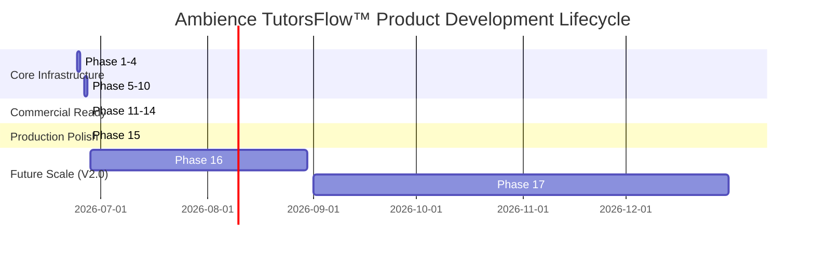

# 🗺️ Product Roadmap — Ambience TutorsFlow™
### Soli Deo Gloria — Glory to God the Father, God the Son, and God the Holy Spirit.

This product roadmap defines the strategic direction, functional milestones, and release plans for **Ambience TutorsFlow™**, mapping our path from core foundation to a mature, enterprise-grade, AI-driven educational SaaS platform.

---

## 📅 Roadmap Overview

---

## 1. Completed Milestones (Phases 1–15)

### Foundation & Multi-Tenant Infrastructure (Phases 1–5)
* **Responsive Portal Shells**: Built dedicated workspaces for Students, Parents, Tutors, and Admins.
* **Scheduling Conflict Engine**: Developed conflict-free booking blocks, calendar integrations, and recurring availability matrices.
* **Strategy Payment Core**: Integrated Stripe Checkout, PayPal SDK, and verified Zelle payments with automatic invoice/receipt generation.
* **Automated Zoom Orchestration**: Linked multi-tenant host-start and student-join video URLs dynamically using live Zoom OAuth refreshes.
* **Supabase Live Synchronization**: Integrated live multi-tenant tables mapped directly to local offline sandbox structures.

### Pedagogical AI Core (Phases 6–10)
* **AI Lesson Planner**: Curated multi-parameter lessons integrated with character virtues (Grit, Perseverance, Integrity, Diligence).
* **AI IEP Goal Planner**: Formulated special-needs tracking engines mapping progress into measurable SMART milestones.
* **AI Tutor & Parent Copilots**: Developed instant subject-specific answers, conversational support, and lesson summarizers.
* **Diagnostic Test Generator**: Built dynamic SAT/ACT and K-12 math and science exam publishers.
* **Unified Collaboration Hub**: Engineered a messaging, care-logs, and action-checklist workspace with dual AI update summaries.

### Commercial SaaS Expansion (Phases 11–14)
* **Tiered Subscriptions Matrix**: Standardized a 7-tier commercial model with Monthly/Yearly options and automated 20% discounts.
* **Self-Service "My Plan" Workspace**: Deployed an active quota usage tracker, card update triggers, and receipts generator.
* **Socratic Homework Assistant**: Structured sequential accordion hints, premium step solvers, and image upload inputs.
* **AI Study Vault**: Engineered concept mastery gauges, topic filters, and drawer search indices.
* **SaaS Telemetry Command Cockpit**: Equipped Administrators with MRR, ARR, active subscriber growth, and churn stats.

### Version 1.0 Release Candidate Polish (Phase 15)
* **Universal Database Search Modal**: Engineered a clientside federated lookup index tracking 9 primary entities in real-time.
* **Interactive Notification Center**: Implemented an alert dropdown supporting mark-as-read/mark-all-read with dynamic category colors.
* **Comprehensive UI/UX & Responsive Audits**: Standardized card alignment, spacing, dark-theme hover states, loading states, and minimum touch target requirements (`44px` height).
* **Accessibility Compliance**: Configured semantic HTML, active focus indicators (`*:focus-visible`), and window Escape listeners.

---

## 2. Future Vision & Version 2.0 Roadmaps

### Phase 16: Regional Scale & Advanced LMS Connectors (Q3 2026)
* **LMS Deep Linking**: Support Canvas, Moodle, and Blackboard LTI 1.3 authentication and gradebook sync.
* **Granular Administrative Delegations**: Deploy custom sub-roles (District Manager, School Principal, Department Head) with narrow access scopes.
* **Geographic Data Localization**: Configure multi-region AWS/Vercel/Supabase hosting architectures to meet global compliance rules.
* **Custom Model Tuning**: Allow school districts to fine-tune AI models utilizing localized curriculum standards.

### Phase 17: Native Mobile Applications & Offline Synchronization (Q4 2026)
* **Native Mobile Apps**: Launch lightweight iOS and Android companion apps built on React Native or Flutter.
* **Offline-First Synchronizer**: Enable students to complete interactive homework worksheets offline, automatically syncing progress when an active connection returns.
* **Real-time Push Notifications**: Trigger SMS, email, and native push reminders for lessons, payments, and homework deadlines.
* **Biometric Auth Integration**: Support FaceID and TouchID login configurations for secure profile switches.

---

Soli Deo Gloria — Glory to God the Father, God the Son, and God the Holy Spirit.
