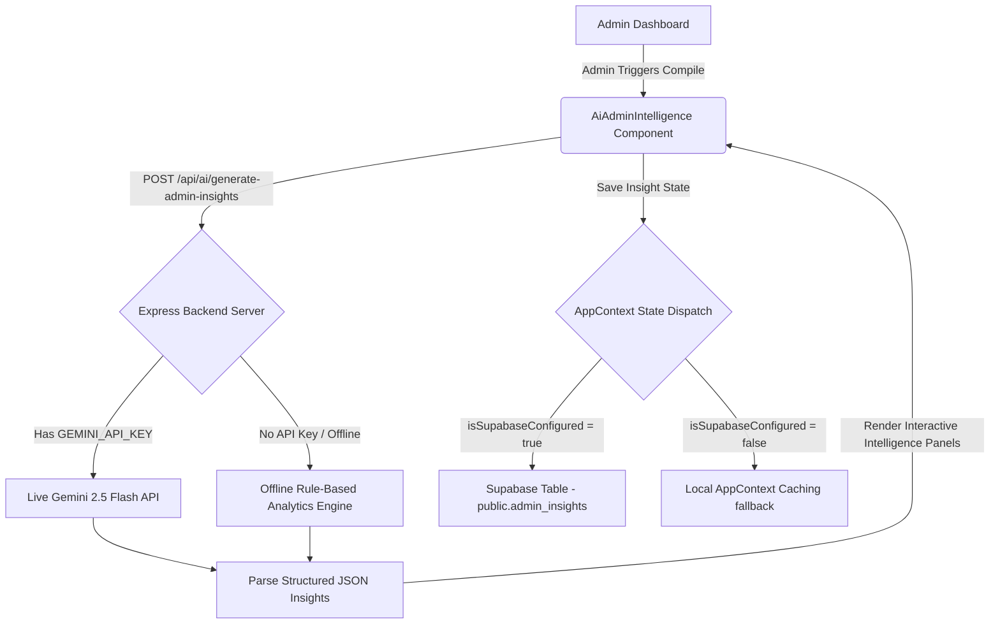

# 🛡️ Administrator Intelligence Center™ Documentation
### Soli Deo Gloria — Dedicated to platform-level stewardship, administrative excellence, and strategic student care.

---

## 📘 Introduction

The **Administrator Intelligence Center™** is the central platform stewardship and strategic operations module within the **Ambience TutorsFlow™** ecosystem. Built specifically for system administrators, it provides platform-wide financial audits, active tutor and student rosters, parent engagement telemetry, AI utilization metrics, student risk assessments, and executive-level AI-powered operational insights.

This feature allows management to view organizational wellness, audit payment splits (Stripe, PayPal, Zelle), track learning progress across subject categories, and receive strategic warnings and step-by-step educational interventions to protect and advance student progress.

---

## 🎯 Core Features

1. **Platform Stewardship KPIs**:
   - **Gross Settled Revenue**: Track gross invoicing collected across Stripe, PayPal, and verified Zelle transfers.
   - **Platform Commissions**: Accumulate platform-level take-rate commissions automatically dynamically based on commission splits.
   - **Net Tutor Disbursements**: Audit total payouts accrued to active instructors.
   - **Active Enrollments**: Track overall numbers of verified tutors and students synchronized on the network.

2. **System Telemetry & Multi-Parameter Filters**:
   - Filter all dashboards and insights by **Date Range**, **Tutor**, **Student**, **Subject**, **Grade Level**, and **Payment Status**.
   - Review platform distribution by academic category core shares (K-12 Core Academics, College Mathematics, SAT & ACT prep, IEP Specialized services).

3. **AI-Powered Tactical Insights**:
   - **Student Risk Detection**: Identifies students with declining session engagement, flatlining test progress, or high streak volatility.
   - **Tutor Performance Summaries**: Distills tutor lesson planning volume, average student progress velocity, and rating feedback.
   - **Parent Engagement Summaries**: Analyzes parent copilot utilization, concerns voiced, and communication frequency.
   - **Revenue Observations**: Detects payment bottlenecks, outstanding invoice concentrations, and transaction flow health.
   - **Suggested Interventions & Recommendations**: Direct step-by-step tactical moves for administrative teams to support struggling students, optimize tutor workloads, and smooth financial friction.

4. **Interactive Compiling Loader**:
   - A fully styled, step-by-step glassmorphic telemetry compiler that gives admins a detailed look at the diagnostic data streams as they are processed (Invoices, Bookings, AI Logs, Profiles).

---

## 🧬 Supported Analysis Parameters

The intelligence model filters and optimizes metrics dynamically across:
- **Subjects**: Mathematics (K-12, Algebra, Calculus, etc.), Science, English / Language Arts, History / Social Studies, Bible Study, Computer / Technology, Test Prep.
- **Grades**: Elementary School, Middle School, 9th-12th Grade, College Undergraduate.
- **Payment Status**: Settled (Paid), Pending Verification, Unpaid (Outstanding).

---

## 🛡️ Architecture & Technical Flow

The Administrator Intelligence Center is integrated into the Express backend and React frontend with the following dual-mode compilation flow:

---

## 🔒 Security & Privacy

Data privacy is strictly guarded through PostgreSQL **Row-Level Security (RLS)** and role-based route middleware:
- Only users with the designated profile role of **Admin** are allowed to query or write records to `public.admin_insights`.
- Frontend database fetching is gated via an explicit profile role check (`profile?.role === 'Admin'`) to prevent unnecessary database queries or security policy alerts for Tutors, Parents, or Students.
- Under the hood, RLS policies explicitly block read/write operations for any non-admin JWT payloads on the Supabase cluster.
