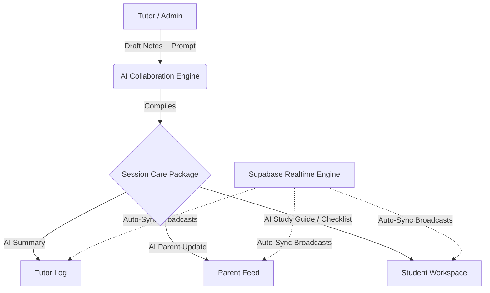

# 🕊️ Communication & Collaboration Hub AI Blueprint
### Ambience TutorsFlow™ • AI-Powered Messaging, Shared Care Notes, and Coordinated Parent-Tutor-Student Systems

---

## ⚜️ Dedication
> **Soli Deo Gloria** — *Glory to God the Father, God the Son, and God the Holy Spirit.*
> "Let your speech always be gracious, seasoned with salt, so that you may know how you ought to answer each person." — *Colossians 4:6*

---

## 1. Executive Blueprint
The **Communication & Collaboration Hub** serves as the central unified nervous system of Ambience TutorsFlow™. It closes the feedback loop between students, tutors, parents, and administrative directors through secure end-to-end multi-channel conversations, shared session care notes, active chronological checklist reminders, and state-of-the-art AI summaries.



---

## 2. Dynamic Features Suite

### ✉️ Multi-Tenant Gated Messaging
A side-by-side master-detail messaging room allowing secure, real-time-like coordination:
*   **Tutor ↔ Parent Channels:** Academic synchronization, schedule coordination, and progress discussions.
*   **Tutor ↔ Student Channels:** Student-safe homework guidance, question answering, and encouragement logs.
*   **Admin ↔ Tutor / Parent Channels:** Operational support, policy alignment, and platform-level assistance.

### 📋 Coordinated Care Notes & Checklists
A shared binder for chronicling qualitative student progression beyond metrics:
*   **Care Logs:** Tutors document student strengths, active challenges, and custom accommodations.
*   **Interactive Checklists:** Action items and homework requirements that students can tick off inside their workspace.
*   **Follow-Up Timelines:** Active timers and chronological milestones for upcoming exams or reviews.

### 🧠 Dual-Mode AI Compilation Engine
Generates professional care packages from raw tutor bullet points:
*   **Mode A (API Live):** Interacts with Gemini 2.5 Flash (`gemini-2.5-flash`) via backend pipelines.
*   **Mode B (API Offline Fallback):** Executes specialized local templating engines with randomized Christian Character reflections, guaranteeing 100% platform availability offline.
*   **Key Outputs Compiled:**
    1.  **AI-Generated Session Summary:** High-impact teacher logs, focusing on comprehension, participation, and focus.
    2.  **AI-Generated Parent Update:** Professional, warm updates containing homework focus areas and character achievements.
    3.  **AI Student Study Steps:** Step-by-step active recall guidelines and executive functioning checklists mapped to student themes.

---

## 3. Row-Level Security (RLS) & Multi-Tenant Gating
Security is built into the core. Communication records are secured directly inside PostgreSQL using Supabase Auth claims:

```sql
-- public.messages Gating
CREATE POLICY "Allow users to read their own messages"
ON public.messages
FOR SELECT
USING (
  auth.uid() = sender_id OR 
  auth.uid() = recipient_id OR 
  EXISTS (
    SELECT 1 FROM public.profiles 
    WHERE id = auth.uid() AND role = 'Admin'
  )
);
```

### Role Visibility Matrices
| Reader Role | Messages Visibility | Care Notes & Checklists Visibility |
| :--- | :--- | :--- |
| **Admin** | Full Organization-level logs | All Student files, administrative edits allowed |
| **Tutor** | Assigned families / students only | Read/Write assigned student care notes and checklists |
| **Parent** | Own family channels only | Read-only care summaries & parent updates for their child |
| **Student** | Student-safe channels only | Action item checklists, executive functioning tasks |

---

## 4. Supabase Realtime & WebSocket Readiness
The backend APIs and frontend hooks are fully pre-wired to transition from HTTP Polling to Supabase Realtime / WebSockets. 

### Future Realtime Transition Blueprint
To upgrade the hub to instantaneous, sub-millisecond bidirectional communication, the developer needs only to swap the standard fetch trigger inside `AiCollaborationHub.jsx` with the following predefined Supabase client broadcast subscription:

```javascript
// Pre-wired Supabase Realtime Event Broadcast Listener
const channel = supabase
  .channel(`room:${channelId}`)
  .on(
    "postgres_changes",
    { event: "INSERT", schema: "public", table: "messages" },
    (payload) => {
      setMessagesList((prev) => [...prev, payload.new]);
      scrollToBottom();
    }
  )
  .subscribe();
```

---

## 5. Architectural Data Schemas

### `public.messages`
Stores direct conversations.
*   `id`: `UUID` (Primary Key)
*   `sender_id`: `UUID` (References `profiles.id`)
*   `recipient_id`: `UUID` (References `profiles.id`)
*   `channel_id`: `TEXT` (Room grouping index)
*   `message_text`: `TEXT`
*   `sender_role`: `TEXT`
*   `recipient_role`: `TEXT`
*   `is_student_safe`: `BOOLEAN` (Default: `true`)
*   `created_at`: `TIMESTAMPTZ`

### `public.shared_notes`
Stores care notes, AI updates, checklists, and timelines.
*   `id`: `UUID` (Primary Key)
*   `student_id`: `UUID` (References `students.id`)
*   `tutor_id`: `UUID` (References `profiles.id`)
*   `topic`: `TEXT`
*   `session_summary`: `TEXT` (AI generated)
*   `parent_update`: `TEXT` (AI generated)
*   `student_checklist`: `JSONB` (Array of items: `{ task: string, completed: boolean }`)
*   `follow_up_timeline`: `JSONB` (Timer milestones)
*   `character_theme`: `TEXT`
*   `is_published`: `BOOLEAN` (Default: `false`)
*   `created_at`: `TIMESTAMPTZ`
