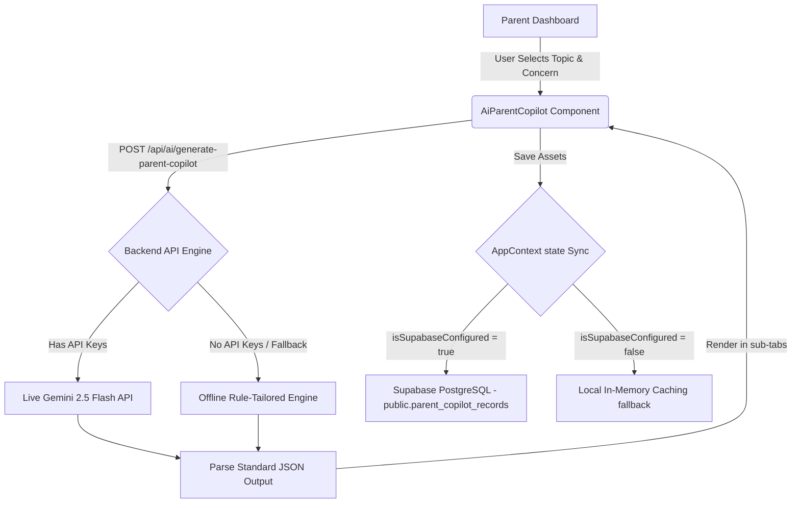

# 🕊️ AI Parent Copilot™ Documentation
### Soli Deo Gloria — Dedicated to academic support, parent empowerment, and character reinforcement.

---

## 📘 Introduction

**AI Parent Copilot™** is a state-of-the-art interactive module within the **Ambience TutorsFlow™** ecosystem. Built specifically for parents, it provides at-home academic coaching, progress synchronization, homework support guides, interactive at-home drills, and customized character reflections.

This feature allows parents to act as capable at-home learning coaches, easing student frustration, matching the tutor's strategies, and reinforcing positive study habits with Christian character virtues.

---

## 🎯 Core Features

1. **At-Home Homework Coaching**: Step-by-step guidance on how to help the student through difficult assignments or test prep without solving the problems for them.
2. **Interactive At-Home Drills**: Simple, hands-on, or verbal practice games and discussions to test and solidify conceptual understanding during daily routines.
3. **Encouragement Messages**: Uplifting, positive messages to read to students to boost motivation, perseverance, and study self-efficacy.
4. **Dialogue Catalysts**:
   - **Questions to Ask the Student**: Warm, conversational questions to check for true conceptual understanding.
   - **Questions to Ask the Tutor**: Informed inquiries regarding student progress, learning barriers, and strategic alignment.
5. **Character and Faith Integration**:
   - **Character Reflections**: Teaches students patience, diligence, resilience, and gratitude.
   - **Bible study reflections**: Encouraging scripture and theological truths that relate study habits to God's word.
6. **Adaptive IEP Support Tips**: Gentle sensory, timing, or pacing accommodations for the parent to ease at-home frustration and overload.

---

## 🧬 Supported Subjects

The module supports 11 comprehensive educational categories:
- **Mathematics** (K-12, Algebra, Geometry, Pre-Calculus, Calculus, Statistics)
- **Science** (Biology, Chemistry, Physics, general Science)
- **English / Language Arts** (Reading comprehension, writing, grammar, vocabulary)
- **History / Social Studies** (Geography, Civics, World History, US History)
- **Bible Study** (Scriptural insights, character analysis, personal application)
- **Computer / Technology** (Logical flows, coding, hardware, software)
- **Physical Education / Health** (Active physical drills, hydration, sleep science)
- **Test Prep** (SAT, ACT, EOG, IOWA)

---

## 🛡️ Architecture & Technical Flow

The Parent Copilot is integrated into the Express backend and React frontend with a seamless multi-tenant database synchronization pattern:

---

## 🔒 Security & Privacy

Data privacy is strictly guarded through PostgreSQL **Row-Level Security (RLS)**:
- Parents can view, create, edit, or delete their own children's logged copilot records.
- Students can view the records associated with their accounts.
- Assigned Tutors and Learning Center Administrators are allowed view-only auditing permissions.
- Unauthenticated users or unrelated profiles are strictly locked out of any tenant's data.
