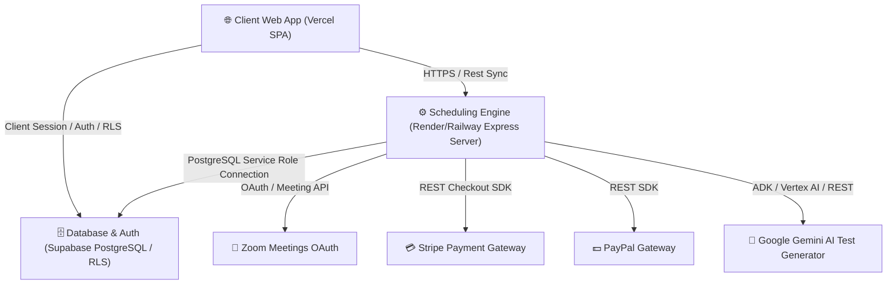

# 🚀 Ambience TutorsFlow™ Production Deployment Hub
### Soli Deo Gloria — Glory to God the Father, God the Son, and God the Holy Spirit.

Welcome to the central deployment documentation hub for **Ambience TutorsFlow™**. This directory contains structured guides and requirements for preparing and deploying all three major tiers of the application into a secure, high-performance production environment.

---

## 🏗️ Production Architecture Overview

The platform uses a decoupled SaaS architecture designed for resilience, security, and effortless scaling:



---

## 📂 Deployment Documentation Index

| Guide | Description | File Link |
| :--- | :--- | :--- |
| **Central Guide** | High-level deployment guidelines and orchestration map | [README.md](file:///D:/Ambience-TutorsFlow/docs/Deployment/README.md) |
| **Vercel Deployment** | Deploying the React 19 / Vite 8 Frontend SPA to Vercel | [Vercel.md](file:///D:/Ambience-TutorsFlow/docs/Deployment/Vercel.md) |
| **Environment Config** | Secure secrets mapping, JWT configurations, and SaaS keys | [Environment.md](file:///D:/Ambience-TutorsFlow/docs/Deployment/Environment.md) |
| **Supabase Setup** | Migrating Schema, Row-Level Security (RLS) policies, and Idempotent Seeding | [Supabase.md](file:///D:/Ambience-TutorsFlow/docs/Deployment/Supabase.md) |

---

## ⏱️ Pre-Deployment Verification Checklist

Before triggering production deployments, ensure the following steps are performed:

1. **Frontend Production Build**:
   ```powershell
   cd frontend
   npm run build
   ```
   *Verify that the static bundle compiles in `< 1s` without any warnings or unresolved module paths.*

2. **Backend Syntax Check**:
   ```powershell
   cd backend
   node -c server.js
   ```
   *Verify that there are zero compilation warnings, reference errors, or syntax errors.*

3. **Backend Health Check Route Validation**:
   *The `GET /health` endpoint has been fully verified, providing standard JSON validation responses:*
   - `status: "healthy"`
   - `uptime` in seconds
   - Verification states for `Supabase`, `Gemini AI`, `Zoom`, `Stripe`, and `PayPal` without exposing raw secrets.

---

## 🔒 Security Hardening Requirements

- **Production Sandbox Lockouts**: All mock data simulation toggles and local bypasses (`sim_token_`) are dynamically disabled when a live `SUPABASE_URL` is detected in the environments.
- **Zero-Dependency Rate Limiting**: The custom Express Map-based memory rate limiter is configured with a 15 requests per minute cap to guard payment, zoom creation, and authorization endpoints.
- **Strict HTTPS Rewrite**: Both Vercel and Render/Railway configurations are configured with secure HTTP headers and strict redirects to prevent middleman sniffing.

---
*For support or technical audits, refer to the individual documents or contact the Engineering Lead.*
