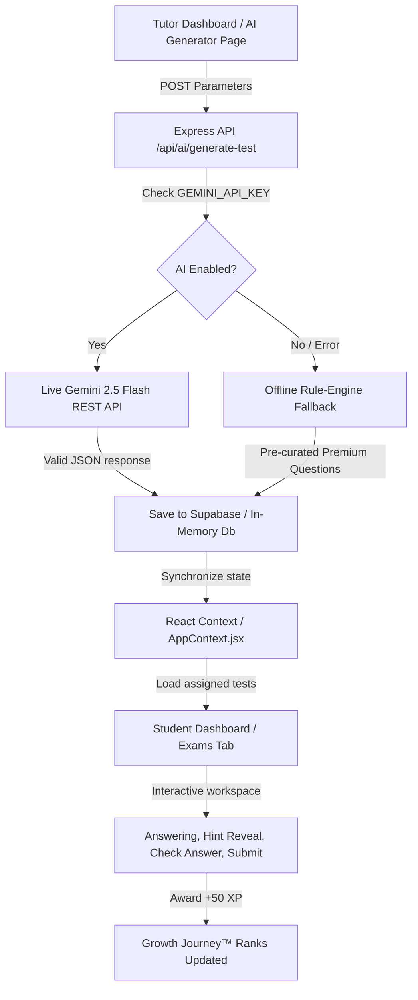

# 🛠️ Phase 4 Technical Notes — AI Test Q&A Generator™

## Soli Deo Gloria
*Glory to God the Father, God the Son, and God the Holy Spirit. Dedicated in gratitude for His divine guidance and guidance throughout the architectural engineering of this platform.*

---

## 🏗️ Technical Architecture & Design Patterns

Phase 4 introduces the first AI-powered module to the **Ambience TutorsFlow™** platform: the **AI Test Q&A Generator™** with step-by-step problem-solving. This is an advanced tutoring assistant and self-study suite that leverages live LLM integration with high-fidelity local fallback engines.

---

## 📊 Database Migration & Schema Setup

A dedicated migration file (`database/migration_phase4.sql`) was developed to provision the PostgreSQL schema under Supabase. The table supports both multi-tenant scoping and global test pools.

### Table Schema: `public.practice_tests`
* **student_id** (UUID, references `profiles.id`): Limits test visibility to a specific student profile. If null, the test behaves as a globally accessible diagnostic test.
* **tutor_id** (UUID, references `profiles.id`): Tracks the tutor authoring the test.
* **title** (TEXT): Rich descriptive title for the generated diagnostic.
* **subject** (TEXT) & **topic** (TEXT): Core educational taxonomy.
* **grade_level** (TEXT) & **difficulty** (TEXT): Adaptive sorting metadata.
* **config** (JSONB): Stores runtime generation toggles, e.g., `{ "includeSolutions": true, "includeAnswerKey": true }`.
* **content** (JSONB): Holds the structural JSON array of questions, choices, hints, solutions, and notes.

---

## ⚡ API Routing and Core Controller Logic

The backend routing layer in `backend/server.js` exposes secure, rate-limited, and authenticated endpoints for test orchestration.

### 1. Endpoint: `POST /api/ai/generate-test`
* **Role Restrictor**: `requireRole(["Tutor", "Admin"])`
* **Live Pipeline**: Communicates with the live Gemini API endpoint `https://generativelanguage.googleapis.com/v1beta/models/gemini-2.5-flash:generateContent` using an HTTPS POST request.
* **Offline Pipeline**: If the API key is missing or invalid, or if the request times out, the backend transparently routes to a high-fidelity local database mapped by subject classifications.

### 2. Endpoint: `POST /api/ai/practice-tests`
* Saves generated test metadata and question arrays into the persistent database.

---

## ⚛️ React State Management & Real-Time Sync

In the frontend React app, `frontend/src/context/AppContext.jsx` was enhanced to seamlessly bind practice tests.

* **State**: `const [practiceTests, setPracticeTests] = useState([])`
* **Real-time Sync**: The `fetchLiveDatabaseData` function pulls assigned practice tests for the active student or organization and formats the camelCase properties dynamically.
* **Database Save Adapter (`addPracticeTest`)**: Handles both live Supabase client insertions and local API fallbacks to ensure bulletproof service regardless of network settings.

---

## 🎨 Premium UI Components & Interaction Mechanics

### 1. Tutor Page (`AiTestGenerator.jsx`)
Features a gorgeous, glassmorphic configurator. Tutors can select subjects, input detailed topics, choose from 11 distinct subject paths, select number of questions, difficulty level, and trigger the generator. On success, the generator displays a beautiful preview.

### 2. Student Portal Workspace (`StudentDashboard.jsx`)
We engineered a side-by-side split layout under the `"Exams"` tab to form a state-of-the-art practice workspace:

* **Left Column**: Lists assigned practice tests. Uses responsive tags for difficulty and subjects, showing completed badges (with scores) or "Start Quiz" actions.
* **Right Column (Diagnostic Workspace)**: When active:
  * Automatically parses `options` for multiple choice, rendering them as interactive radio cards, or provides a short-text input for writing prompts and coding scripts.
  * **Verify Answer Action**: Students can verify their work question-by-question. The check button compares answers in a case-insensitive manner.
  * **Pedagogical Solution Reveal**: On validation, the UI displays step-by-step problem-solving instructions, the final answer key, common pitfalls, and tutoring notes with elegant animations.
  * **Sequential Hints**: Allows students with IEP or focus accommodations to expand hint cards individually.
  * **Submit Action**: Computing the final score, updating the UI completed list, and triggering the `awardPoints(50)` modifier.

---

## 🔒 Security Posture & Verification
* All API routes are protected with JWT auth.
* Local simulation blocks any unauthorized admin/tutor operations while ensuring full sandbox compliance when Supabase variables are absent.
* Strict JSON structure schemas enforced during live LLM prompts to prevent formatting failures.
