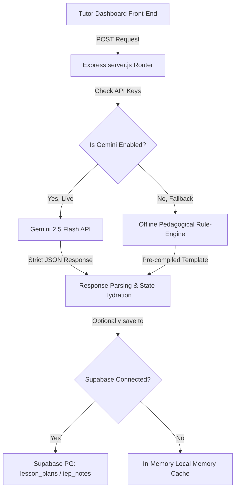

# 🛠️ Phase 6 Technical Notes
### Soli Deo Gloria — Glory to God the Father, God the Son, and God the Holy Spirit.

This document provides a technical breakdown of the architecture, data schemas, API routes, and security configurations implemented during Phase 6.

---

## 🏗️ Architecture Design

The Version 2.0 AI Integration utilizes a decoupled, resilient architecture that handles both live API requests and offline simulation fallback mode:



---

## 🔌 API Route Specifications

### 1. AI Lesson Planner Endpoints

#### `POST /api/ai/generate-lesson-plan`
Generates a complete, standards-aligned lesson plan.
* **Access**: Authenticated users with role `Tutor` or `Admin`.
* **Payload Variables**:
  ```json
  {
    "studentId": "UUID (Optional)",
    "gradeLevel": "7th Grade",
    "subject": "Math",
    "topic": "System of Linear Equations",
    "duration": "60 minutes",
    "learningObjective": "Solve equations by elimination",
    "difficulty": "Medium",
    "includeHomework": true,
    "includeAssessment": true,
    "includeCharacterEducation": true
  }
  ```
* **Output Format**: Raw JSON object containing `lessonTitle`, `objectives`, `warmUp`, `directInstruction`, `guidedPractice`, `independentPractice`, `exitTicket`, `homework`, `teacherGuide`, and `differentiationNotes`.

#### `POST /api/ai/lesson-plans`
Saves a lesson plan to local in-memory state (used for offline fallback).
* **Access**: Tutors or Admins.

#### `GET /api/ai/lesson-plans`
Retrieves saved lesson plans, with optional filters for `studentId` or `tutorId`.

---

### 2. AI IEP Assistant Endpoints

#### `POST /api/ai/generate-iep-notes`
Generates an Individualized Education Program support plan.
* **Access**: Authenticated users with role `Tutor` or `Admin`.
* **Payload Variables**:
  ```json
  {
    "studentId": "UUID (Required)",
    "studentName": "Caleb",
    "strengths": "Verbal articulation, high spatial intelligence",
    "challenges": "Fractions decoding barriers, ADHD working memory delays",
    "currentGoals": "Improve single digit multiplication speed"
  }
  ```
* **Output Format**: Raw JSON object containing `strengths`, `challenges`, `accommodationSuggestions`, `goalDrafting` (SMART formatting), `progressNotes`, `parentSummary`, and `tutorSteps`.

#### `POST /api/ai/iep-notes`
Saves IEP support notes to local in-memory registry.

#### `GET /api/ai/iep-notes`
Retrieves saved IEP reports, with optional filters for `studentId` or `tutorId`.

---

## 🎯 Prompt Engineering Strategies

To guarantee consistent formatting, the Express backend isolates configuration variables from the generator's core rules:

1. **System Instruction Isolation**: Restricts the AI using system instructions rather than raw prompt queries, resulting in more stable output.
2. **Strict MIME Output Enforcement**: Uses Google's `responseMimeType: "application/json"` configuration to guarantee clean JSON parsing on every request.
3. **Character Education Token Injection**: Injects specific prompts to weave character metrics (*Grit, Integrity, Diligence, and Perseverance*) into the objectives and student work sections:
   ```javascript
   if (includeCharacterEducation) {
     obj += ` Injects reflections on Grit and Perseverance.`;
   }
   ```

---

## 🗄️ Database Schemas & Row-Level Security

### 1. `public.lesson_plans` Table
Stores custom lesson plans. Uses a `JSONB` data type for both configuration inputs and output content, facilitating flexible future schema expansions.

```sql
CREATE TABLE public.lesson_plans (
    id UUID DEFAULT uuid_generate_v4() PRIMARY KEY,
    student_id UUID REFERENCES public.students(id) ON DELETE CASCADE,
    tutor_id UUID REFERENCES public.tutors(id) ON DELETE SET NULL,
    title TEXT NOT NULL,
    grade_level TEXT NOT NULL,
    subject TEXT NOT NULL,
    topic TEXT NOT NULL,
    duration TEXT NOT NULL,
    learning_objective TEXT,
    difficulty TEXT NOT NULL,
    config JSONB DEFAULT '{}'::JSONB NOT NULL,
    content JSONB DEFAULT '{}'::JSONB NOT NULL,
    created_at TIMESTAMP WITH TIME ZONE DEFAULT timezone('utc'::text, now()) NOT NULL,
    updated_at TIMESTAMP WITH TIME ZONE DEFAULT timezone('utc'::text, now()) NOT NULL
);
```

### 2. `public.iep_notes` Table
Stores structured IEP support plans.

```sql
CREATE TABLE public.iep_notes (
    id UUID DEFAULT uuid_generate_v4() PRIMARY KEY,
    student_id UUID REFERENCES public.students(id) ON DELETE CASCADE NOT NULL,
    tutor_id UUID REFERENCES public.tutors(id) ON DELETE SET NULL NOT NULL,
    strengths TEXT NOT NULL,
    challenges TEXT NOT NULL,
    accommodations TEXT NOT NULL,
    goals TEXT NOT NULL,
    progress_notes TEXT NOT NULL,
    parent_summary TEXT NOT NULL,
    tutor_steps TEXT NOT NULL,
    created_at TIMESTAMP WITH TIME ZONE DEFAULT timezone('utc'::text, now()) NOT NULL,
    updated_at TIMESTAMP WITH TIME ZONE DEFAULT timezone('utc'::text, now()) NOT NULL
);
```

### 🔒 Row-Level Security (RLS) Policies
Both tables are locked down using multi-tenant security policies:
* Only authenticated users associated with the student (the student themselves, their parent, or their tutor) can view reports.
* Only authenticated tutors and administrators can insert or modify entries.

```sql
CREATE POLICY "IEP notes are visible to assigned student, tutor, linked parent, or admin"
  ON public.iep_notes FOR SELECT TO authenticated USING (
    student_id = auth.uid() OR
    tutor_id = auth.uid() OR
    student_id IN (SELECT id FROM public.students WHERE parent_id = auth.uid()) OR
    public.get_current_user_role() IN ('Tutor', 'Admin')
  );
```

---

## 🛡️ Offline Resiliency Engine

For local testing and deployments without live API keys, the backend uses a fallback engine:

1. **Parameter Detection**: Automatically checks for the presence of valid environment keys (`GEMINI_API_KEY` or `AI_API_KEY`).
2. **Structured String Templates**: Generates complete, highly readable, structured lessons and IEP outlines dynamically based on the user's inputs.
3. **Seamless State Hand-off**: Outputs are returned using identical JSON structures, ensuring the frontend handles live and fallback data seamlessly.
