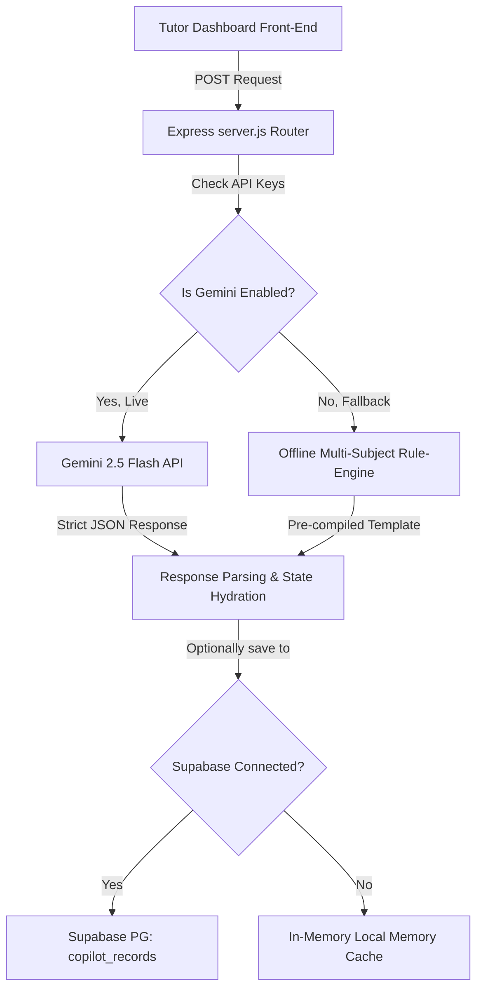

# 🛠️ Phase 7 Technical Notes
### Soli Deo Gloria — Glory to God the Father, God the Son, and God the Holy Spirit.

This document provides a technical breakdown of the architecture, data schemas, API routes, and security configurations implemented during Phase 7.

---

## 🏗️ Architecture Design

The AI Tutor Copilot system utilizes a modular, resilient architecture that handles both live API requests and offline simulation fallback mode:



---

## 🔌 API Route Specifications

### 1. AI Tutor Copilot Endpoints

#### `POST /api/ai/generate-copilot`
Generates real-time live support tutoring assets.
* **Access**: Authenticated users with role `Tutor` or `Admin`.
* **Payload Variables**:
  ```json
  {
    "studentId": "UUID (Optional)",
    "studentName": "Alex",
    "subject": "Mathematics",
    "topic": "Rational Equations",
    "gradeLevel": "9th Grade",
    "currentLesson": "Algebra Section 4.2",
    "studentChallenge": "Doesn't understand reciprocal products.",
    "supportType": "Analogy"
  }
  ```
* **Output Format**: Raw JSON object containing `simpleExplanation`, `deeperExplanation`, `teachingGuide`, `exampleProblem`, `practiceProblems`, `hints`, `commonMistakes`, `iepAccommodations`, `characterReflection`, `parentSummary`, and `tutorNotes`.

#### `POST /api/ai/copilot-records`
Saves a copilot run record to local in-memory state (used for offline fallback).
* **Access**: Tutors or Admins.

#### `GET /api/ai/copilot-records`
Retrieves saved copilot run histories, with optional filters for `studentId` or `tutorId`.

---

## 🎯 Prompt Engineering Strategies

To guarantee consistent formatting and high-quality pedagogical output, the Express backend isolates configuration variables from the generator's core rules:

1. **System Instruction Isolation**: Restricts the AI using system instructions rather than raw prompt queries, resulting in more stable output.
2. **Strict MIME Output Enforcement**: Uses Google's `responseMimeType: "application/json"` configuration to guarantee clean JSON parsing on every request.
3. **Character Education Token Injection**: Injects specific prompts to weave character metrics (*Grit, Integrity, Diligence, and Perseverance*) into the learning experience.
4. **IEP Accommodation Matching**: Injects instructions to formulate specific special education support accommodations matching the student's stated challenge.

---

## 🗄️ Database Schemas & Row-Level Security

### 1. `public.copilot_records` Table
Stores custom copilot records. Uses a `JSONB` data type for output content, facilitating flexible future schema expansions.

```sql
CREATE TABLE public.copilot_records (
    id UUID DEFAULT uuid_generate_v4() PRIMARY KEY,
    student_id UUID REFERENCES public.students(id) ON DELETE CASCADE,
    tutor_id UUID REFERENCES public.tutors(id) ON DELETE SET NULL,
    subject TEXT NOT NULL,
    topic TEXT NOT NULL,
    grade_level TEXT NOT NULL,
    session_context TEXT,
    student_challenge TEXT,
    support_type TEXT,
    content JSONB DEFAULT '{}'::JSONB NOT NULL,
    created_at TIMESTAMP WITH TIME ZONE DEFAULT timezone('utc'::text, now()) NOT NULL,
    updated_at TIMESTAMP WITH TIME ZONE DEFAULT timezone('utc'::text, now()) NOT NULL
);
```

### 🔒 Row-Level Security (RLS) Policies
The table is locked down using multi-tenant security policies:
* Only authenticated users associated with the student (the student themselves, their parent, or their tutor) can view records.
* Only authenticated tutors and administrators can insert or modify entries.

```sql
CREATE POLICY "Copilot records are visible to assigned student, tutor, parent, or admin"
  ON public.copilot_records FOR SELECT TO authenticated USING (
    student_id = auth.uid() OR
    tutor_id = auth.uid() OR
    student_id IN (SELECT id FROM public.students WHERE parent_id = auth.uid()) OR
    public.get_current_user_role() IN ('Tutor', 'Admin')
  );
```

---

## 🛡️ Offline Resiliency Engine

For local testing and deployments without live API keys, the backend uses afallback engine:

1. **Parameter Detection**: Automatically checks for the presence of valid environment keys (`GEMINI_API_KEY` or `AI_API_KEY`).
2. **Subject-Specific Tailoring**: Generates complete, highly readable, structured lessons and copilot assets dynamically based on the subject (Mathematics, Science, English Language Arts, Bible Study, Computer Tech, and others).
3. **Seamless State Hand-off**: Outputs are returned using identical JSON structures, ensuring the frontend handles live and fallback data seamlessly.
