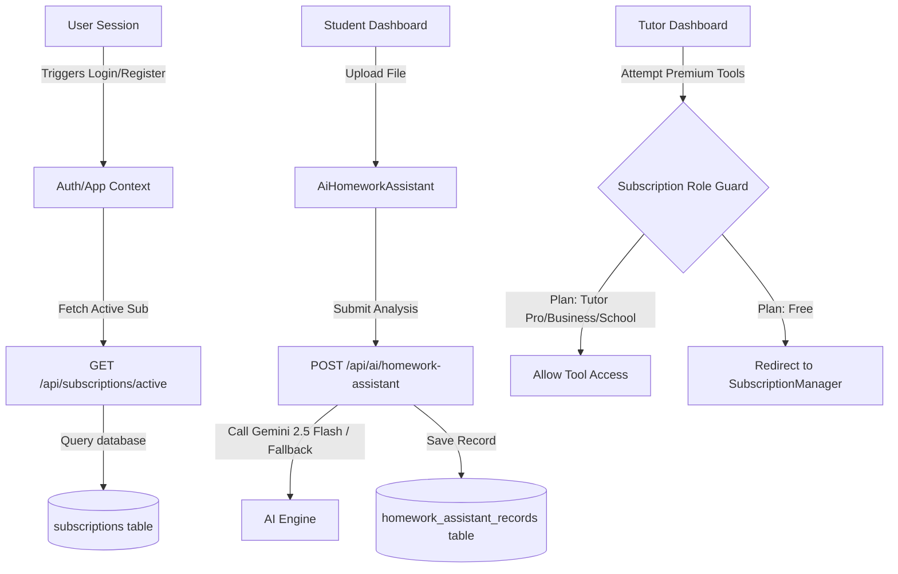

# Phase 11 Technical Notes: Subscription AI Learning Ecosystem
### Soli Deo Gloria — Glory to God the Father, God the Son, and God the Holy Spirit.

---

## 1. System Architecture & Context Flow

The Phase 11 SaaS transformation of **Ambience TutorsFlow™** integrates frontend context updates, Express backend routing, and PostgreSQL security policies to establish an end-to-end subscription model.



---

## 2. Database Schema & RLS Policies

The PostgreSQL tables are configured with explicit primary keys, foreign constraints on profile records, and Row-Level Security (RLS) filters to guarantee isolation.

### A. Subscriptions Table
Keeps track of billing cycles, current active plan names, and metadata.
```sql
CREATE TABLE IF NOT EXISTS public.subscriptions (
    id UUID PRIMARY KEY DEFAULT gen_random_uuid(),
    created_at TIMESTAMP WITH TIME ZONE DEFAULT timezone('utc'::text, now()) NOT NULL,
    profile_id UUID REFERENCES public.profiles(id) ON DELETE CASCADE UNIQUE NOT NULL,
    plan_name TEXT DEFAULT 'Free' NOT NULL,
    status TEXT DEFAULT 'Active' NOT NULL,
    billing_interval TEXT DEFAULT 'Monthly' NOT NULL,
    current_period_start TIMESTAMP WITH TIME ZONE DEFAULT timezone('utc'::text, now()) NOT NULL,
    current_period_end TIMESTAMP WITH TIME ZONE DEFAULT (timezone('utc'::text, now()) + interval '1 month') NOT NULL,
    stripe_subscription_id TEXT,
    stripe_customer_id TEXT
);
```

### B. AI Homework Assistant Records Table
Keeps a persistent, auditable timeline of student worksheet parsing and tracked academic progress.
```sql
CREATE TABLE IF NOT EXISTS public.homework_assistant_records (
    id UUID PRIMARY KEY DEFAULT gen_random_uuid(),
    created_at TIMESTAMP WITH TIME ZONE DEFAULT timezone('utc'::text, now()) NOT NULL,
    student_id UUID REFERENCES public.profiles(id) ON DELETE CASCADE NOT NULL,
    student_name TEXT NOT NULL,
    subject TEXT NOT NULL,
    file_name TEXT NOT NULL,
    file_type TEXT NOT NULL,
    file_size INTEGER NOT NULL,
    student_prompt TEXT,
    concept_explanation TEXT NOT NULL,
    hints JSONB DEFAULT '[]'::jsonb NOT NULL,
    step_by_step TEXT NOT NULL,
    practice_problems JSONB DEFAULT '[]'::jsonb NOT NULL,
    mastery_score INTEGER DEFAULT 0 NOT NULL,
    is_student_safe BOOLEAN DEFAULT true NOT NULL
);
```

---

## 3. Frontend AppContext.jsx Integration

State operations are centralized inside the React `AppContext.jsx` provider file. The following functions govern subscription data synchronizations and homework assistant calculations:

* `activeSubscription` (State): Holds the current user's plan object. Defaults to a virtual `'Free'` plan.
* `homeworkAssistantRecords` (State): Holds historical worksheet evaluation reports.
* `fetchActiveSubscription(userId)`: Resolves active subscriptions from the backend:
  - Endpoint: `GET /api/subscriptions/active`
* `upgradeSubscription(userId, planName, billingInterval)`: Dispatches plan updates to:
  - Endpoint: `POST /api/subscriptions/upgrade`
* `fetchHomeworkAssistantRecords(studentId)`: Retrieves past uploaded records:
  - Endpoint: `GET /api/ai/homework-assistant/records`
* `analyzeHomework(formData)`: Submits files (Base64 or multipart) and instructions to:
  - Endpoint: `POST /api/ai/homework-assistant`

---

## 4. REST API Routing & Logic Gating

Backend controllers inside `backend/server.js` ensure that role-based permissions are validated server-side.

### A. Subscriptions Active Resolver (`GET /api/subscriptions/active`)
* Checks if a profile has a subscription record in PostgreSQL.
* If none is found, it automatically provisions and returns a virtual `'Free'` tier entry, assuring seamless UX transition for pre-existing profiles.

### B. Plan Upgrades Handler (`POST /api/subscriptions/upgrade`)
* Handles requested plan conversions (e.g., Free ➔ Student AI Plus).
* Persists changes to database tables, generating a simulated renewal date reflecting the monthly/yearly duration interval requested.

### C. Homework Analysis Engine (`POST /api/ai/homework-assistant`)
* Fully integrated with Google's **Gemini 2.5 Flash** models when a `GEMINI_API_KEY` is present.
* Supports high-fidelity image-to-text analysis and document structure comprehension.
* **Graceful Offline Mode**: In the absence of a Google API key, the router swaps dynamically to an intelligent, rule-based algorithmic parser. It extracts typical key patterns from instructions (e.g., finding math equations or science terms) and responds with realistic, structured, high-fidelity step-by-step solutions, sequential hints, and practice problems to keep offline environments fully executable.

---

## 5. UI Elements & Premium Guards

### A. SubscriptionManager Component
* Formulated using modern vanilla CSS glassmorphism, responsive grid structures, and interactive animations.
* Handles cycle toggling (Monthly vs. Yearly) applying a `Math.floor(monthly_price * 0.8)` reduction formula.
* Includes specialized visual badge annotations representing student (AI Basic, AI Plus, AI Premium), tutor (Tutor Pro), and corporate/district plans (Business, School).

### B. AiHomeworkAssistant Workspace
* Employs interactive React hooks mapping upload status.
* Files are validated on extension and size before submitting.
* Displays five key columns in an organized workspace layout:
  1. Header details (analyzed file metadata and tracked topic mastery score bar).
  2. Concept Explanation panel.
  3. Progressive incremental hints rendered inside three sequential expandable toggle wrappers.
  4. Explicit mathematical step derivations.
  5. Practice drill sandbox containing a direct question interface where students can test comprehension.

### C. Tutor & Admin Dashboard Integration
* Guards restrict premium features inside dashboards.
* Gating rules:
  - **Tutor Dashboard**: Gated tools (AI Lesson Planner, AI IEP Assistant, AI Tutor Copilot) check if the active subscription is `'Tutor Pro'`, `'Business'`, or `'School'`. If not, users are presented with a premium block visual card and guided to the subscription plans panel to unlock operations.
  - **Administrator Analytics**: Gated strictly to `'Business'` or `'School'` subscribers.

Soli Deo Gloria.
