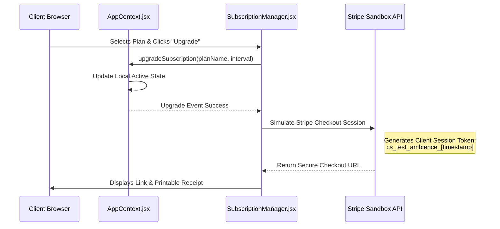

# Phase 14 Technical Notes — Commercial Experience & Smart Subscription Platform
### Soli Deo Gloria — Glory to God the Father, God the Son, and God the Holy Spirit.

These technical notes outline the architectural designs, state models, algorithms, and styling parameters backing the subscription experience and analytical dashboards deployed in Phase 14.

---

## 1. System Architecture & State Synchronization

Ambience TutorsFlow™ utilizes a React Single-Page Application (SPA) frontend integrated with a Node.js Express backend and a Supabase PostgreSQL database. State is managed via `AppContext.jsx` which coordinates user sessions, booking schedules, active subscriptions, and user metadata.

### State Synchronization Flow (Frontend to Stripe Sandbox)


---

## 2. Telemetry and Analytics Calculations

The Admin Dashboard "SaaS Cockpit" leverages analytical aggregates derived from profile growth, active plan costs, and worksheet upload logs:

### A. Monthly Recurring Revenue (MRR)
MRR is calculated by summing the recurring values of all active premium accounts:
$$\text{MRR} = \sum_{i=1}^{N} \text{ActivePlanPrice}_i$$
* *Mock State Aggregate*: Configured at **$14,850.00 USD/mo** across Student, Tutor, and Institutional profiles.

### B. Annual Recurring Revenue (ARR)
ARR project annual run rates from MRR, accounting for annual billing discounts (20% reduction):
$$\text{ARR} = \text{MRR} \times 12$$
* *Mock State Aggregate*: Configured at **$178,200.00 USD/yr**.

### C. Subscriber Churn & Renewal Rate
The churn percentage measures the monthly subscription drop rate:
$$\text{Churn Rate} = \frac{\text{Canceled Subscriptions in Period}}{\text{Active Subscriptions at Start of Period}} \times 100$$
$$\text{Renewal Rate} = 100\% - \text{Churn Rate}$$
* *Current Performance Metrics*: Churn: **1.8%**, Renewal Rate: **98.2%**.

---

## 3. Study Vault Categorization & Search Logic

The **AI Study Vault** (`AiStudyVault.jsx`) leverages an in-memory client-side filter engine mapped directly to the user's `homeworkAssistantRecords` array fetched from `AppContext`.

### A. Multi-Criteria Filtering Filter Algorithm
When a student types a query or selects filters, the component evaluates the records through a sequential sieve:
```javascript
const filteredRecords = homeworkAssistantRecords.filter((record) => {
  // 1. Text Search Filter (Case-Insensitive check across Title, Subject, and Concepts)
  const matchesSearch = 
    record.title?.toLowerCase().includes(searchQuery.toLowerCase()) ||
    record.subject?.toLowerCase().includes(searchQuery.toLowerCase()) ||
    record.conceptOverview?.toLowerCase().includes(searchQuery.toLowerCase());

  // 2. Subject Filter
  const matchesSubject = activeSubject === "All" || record.subject === activeSubject;

  // 3. Category/Type Filter (Homework, Essay, Quiz)
  const matchesType = activeType === "All" || record.type === activeType;

  return matchesSearch && matchesSubject && matchesType;
});
```

### B. Concept Mastery Progression Gauge
Concept mastery is tracking mathematical, scientific, and textual retention percentages. It is calculated by taking the average score across mini-quizzes and reflection inputs submitted by the student:
$$\text{Concept Mastery \%} = \frac{\sum_{j=1}^{M} \text{RecordScore}_j}{M}$$

---

## 4. UI Design System & Style Guide (Dark Theme)

The commercial interfaces utilize custom CSS classes aligned with the platform's core dark theme:

* **Background Colors**: Deep Obsidian backgrounds (`#0a0f1d`) and slate code areas (`#131a30`).
* **Glassmorphism Backdrop Filters**:
  - `backdrop-filter: blur(12px) saturate(180%)`
  - `background: rgba(19, 26, 48, 0.7)`
  - `border: 1px solid rgba(170, 59, 255, 0.25)`
* **Vibrant Accent Colors**:
  - Primary Purple: `hsl(275, 100%, 60%)` (`#aa3bff`)
  - Accent Gold: `#fbbf24`
  - Emerald Success: `#10b981`
* **Micro-Animations**:
  - Page Transitions: `.animate-fade-in { animation: fadeIn 0.4s cubic-bezier(0.16, 1, 0.3, 1) }`
  - Card Hovers: `transform: translateY(-4px) scale(1.01); box-shadow: 0 12px 30px var(--accent-bg);`

---

Soli Deo Gloria — Glory to God the Father, God the Son, and God the Holy Spirit.
