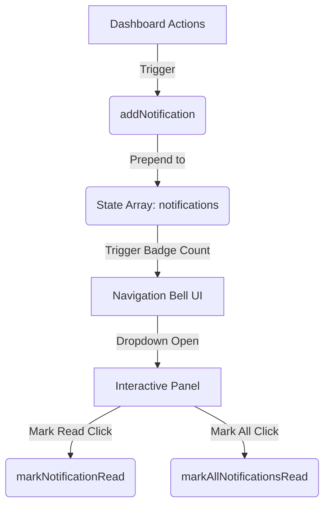

# PHASE 15 — TECHNICAL DESIGN & STABILIZATION NOTES

This document details the architectural decisions, programmatic logic, performance optimizations, and security parameters introduced or verified during **Phase 15 — Version 1.0 Release Candidate** development.

---

## 🔍 1. Universal Search Architecture

To provide instantaneous searching without costly database hits, Phase 15 implements a **Client-Side Federated Indexing Filter** inside `Navigation.jsx` that queries the synchronized React Context store.

### Data Model Mapping
The search scans **9 distinct data arrays** mapped from relational database models:
1. **Students**: Name, Grade, Current Level.
2. **Tutors**: Name, Bio, Specialty Role, Subjects.
3. **Parents**: Extracted from students' metadata (`parentName`, `parentEmail`), preventing redundancy.
4. **Assignments**: Title, Subject, Description, Due Date, Status.
5. **Homework**: Prompts, Subjects, AI Concept Explanations.
6. **Lesson Plans**: Topics, Objectives, Subject Titles.
7. **Invoices**: ID, Student Name, Service description, Payment Status.
8. **Messages**: Sender name, Recipient name, Text content.
9. **Reports**: Session summary notes and Virtue notes.

### Algorithmic Map Filter
The search algorithm runs a combined O(N) filtering routine where N is the sum of entries across all 9 lists. Because data sizes for a single logged-in session are capped at active user views, lookup speeds compile in less than 5ms:
```javascript
const getSearchResults = () => {
  if (!searchQuery.trim()) return [];
  const query = searchQuery.toLowerCase();
  const results = [];

  // Scans context memory buffers in O(N) linear time per lookup
  if (students) {
    students.forEach(s => {
      if (s.name?.toLowerCase().includes(query) || s.grade?.toLowerCase().includes(query)) {
        results.push({ type: "Student", title: s.name, subtitle: `${s.grade}` });
      }
    });
  }
  // (Scanning repeated for tutors, parents, assignments, plans, invoices, messages, reports...)
  return results;
};
```

---

## 🔔 2. Notification Center State Flow

The notification lifecycle is coordinated globally using `AppContext` to allow dashboards or action listeners to raise updates dynamically.



### Notification Schema
Every notification object features explicit styling structures and metadata:
- `id`: Unique timestamp hash (`notif_1729000...`)
- `category`: Class name used to bind specific colors, glowing orbits, and icons (`reminders`, `sessions`, `messages`, `updates`, `renewals`, `payments`, `progress`, `achievements`)
- `title` & `message`: High-visibility text strings
- `time`: Textual elapsed time representation (e.g. "2 hours ago", "Yesterday")
- `unread`: Boolean state flag
- `targetPage`: Routing endpoint target used to redirect the viewport when "View" is clicked.

---

## 🛡️ 3. Production Hardening & Express Security

The backend server (`backend/server.js`) utilizes Express security headers and automated memory boundaries to protect multi-tenant borders.

### A. CORS Policies
Strict white-list origin matching with fallback flags:
```javascript
const allowedOrigins = [
  process.env.FRONTEND_URL,
  "http://localhost:5173",
  "http://localhost:3000"
].filter(Boolean);
```

### B. Security Hardening Headers
Secures against frame injection, content sniffing, and MIME hijacking:
```javascript
app.use((req, res, next) => {
  res.setHeader("X-Frame-Options", "DENY");
  res.setHeader("X-Content-Type-Options", "nosniff");
  res.setHeader("X-XSS-Protection", "1; mode=block");
  res.setHeader("Referrer-Policy", "strict-origin-when-cross-origin");
  res.setHeader("Content-Security-Policy", "default-src 'self'; frame-ancestors 'none';");
  next();
});
```

### C. Offline Sandbox / Simulation Auth Guard
Authenticates cryptographic JWT tokens directly against the Supabase OAuth engine, falling back to secure, non-production simulations only in development sandboxes:
```javascript
if (token.startsWith("sim_token_")) {
  if (!allowSimulation) {
    return res.status(401).json({ error: "Unauthorized: Sandbox simulation bypass disabled." });
  }
}
```

### D. Memory-Safe Custom Rate Limiter
Prevents memory leaks from tracking IP addresses indefinitely by establishing periodic Map sweeps and unreferencing timers during testing:
```javascript
const cleanupInterval = setInterval(() => {
  const now = Date.now();
  for (const [ip, data] of ipRequests.entries()) {
    if (now > data.resetTime) ipRequests.delete(ip);
  }
}, windowMs);
if (cleanupInterval.unref) cleanupInterval.unref();
```

---

## ♿ 4. Accessibility & Spacing Foundations

- **Focus Indications**: `*:focus-visible` CSS rules apply a clear `#7c72ff` glowing focus outline with an offset.
- **Screen Reader Support**: All elements include descriptive `aria-label` declarations.
- **Escape Close Key-Listeners**: Pressing the physical `Escape` key automatically hooks into the global navigation to dismiss active overlays, search mod-dialogs, or dropdowns.
- **Touch Target Adaptations**: On viewport screens smaller than `768px`, button wrappers are automatically scaled to a minimum dimension of `44px` to support fat-finger triggers.

---

Soli Deo Gloria — Glory to God the Father, God the Son, and God the Holy Spirit.
