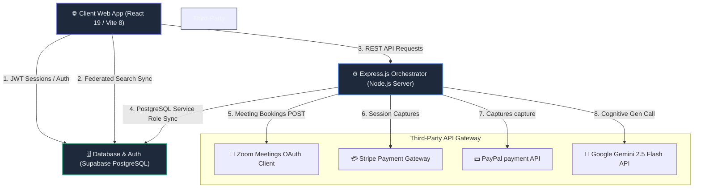

# 📐 System Architecture Diagram & Security Flow Explanation
### Soli Deo Gloria — Glory to God the Father, God the Son, and God the Holy Spirit.

This document describes the multi-tier architectural topology, security boundaries, and secure networking routes powering **Ambience TutorsFlow™**.

---

## 1. Multi-Tier Architecture Diagram

The system coordinates the client-side single-page application, an Express scheduling coordinator, the Supabase Postgres database, and external cognitive/payment APIs:

---

## 2. Dynamic Operational Segments

### A. Client Web App Tier (React 19 / Vite 8)
* **Function**: Executes the user interface across all four portal dashboards, manages clientside federated search, and processes websocket notifications.
* **Authentication**: On start, authenticates directly with Supabase Identity Services using JSON Web Tokens (JWT). All subsequent direct read/write requests to PostgreSQL send the active bearer authorization header.

### B. Business Logic Orchestrator Tier (Node.js / Express.js)
* **Function**: Coordinates complex cross-platform workflows (such as locking payment captures, generating automated invoices, and managing Zoom bearer key refreshes).
* **Communication Rules**: Communicates securely over HTTPS using strict SSL parameters, preventing intermediary packet sniffing.
* **Security Barriers**: Enforces an Express sliding rate limiter (capping traffic at 15 req/min) to prevent request flooding and API exploitation.

### C. Database & Security Tier (Supabase / PostgreSQL)
* **Function**: Stores relational data tables and validates transactional triggers.
* **Security Controls (RLS)**: Enforces PostgreSQL Row-Level Security (RLS) rules on all tables. This guarantees that users can only select or write rows where `auth.uid() = profile_id`, ensuring complete isolation in multi-tenant environments.

---

## 3. Core Operational Data Flows

### A. Automated Tutor-Student Booking Pipeline
1. **Request**: Student submits a booking request through the React Calendar interface.
2. **Availability Check**: Express API checks availability matrices to prevent calendar conflicts.
3. **Meeting Scheduling**: API communicates with Zoom’s Server-to-Server OAuth gateway to generate a host meeting slot, returning dynamic links.
4. **Serialization**: Saves meeting urls and reservation records directly to PostgreSQL tables via secure credentials.

### B. Strategy-Pattern Payment Settlement Pipeline
1. **Initiation**: Parent triggers a lesson settlement.
2. **Strategy Evaluation**: The payment controller executes the selected payment processor (Stripe, PayPal, or Zelle).
3. **Capture**: If using Stripe, initializes a secure Stripe Checkout session.
4. **Fulfillment**: Webhooks capture the transaction, writing records to PostgreSQL payment ledgers and unlocking student learning quotas.

---

Soli Deo Gloria — Glory to God the Father, God the Son, and God the Holy Spirit.
