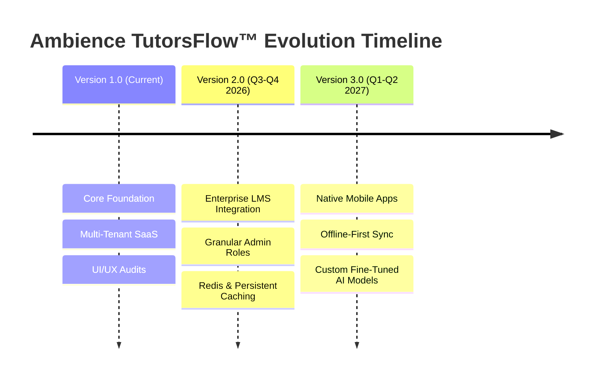

# 🗺️ Future Product Roadmap — Version 2.0 & Version 3.0 — Ambience TutorsFlow™
### Soli Deo Gloria — Glory to God the Father, God the Son, and God the Holy Spirit.

This roadmap details the strategic vision, feature planning, and functional objectives mapped for **Version 2.0** and **Version 3.0** of **Ambience TutorsFlow™**.

---

## 📅 Roadmap Timeline

---

## 🚀 Version 2.0 — Enterprise Scaling (Q3-Q4 2026)

The primary goal of Version 2.0 is to expand platform support for large-scale learning organizations, private academies, and school districts.

### 🔌 LTI 1.3 Canvas & Moodle Connectors
* **Deep Linking**: Implement standard Learning Tools Interoperability (LTI 1.3) protocols to enable seamless single-sign-on (SSO) authentication from district LMS platforms (Canvas, Blackboard, and Moodle).
* **Gradebook Sync**: Automate student homework grades and diagnostic test scores sync back to school rosters.

### 🎭 Granular Administrative Sub-roles
* Deconstruct the root Admin role to support specialized administrative sub-roles:
  - **District Manager**: Full diagnostic auditing rights across multiple linked academies.
  - **School Principal**: Dedicated view of classroom schedules, tutor metrics, and IEP logs within a single academy.
  - **Department Head**: Content management rights to configure curriculum parameters and custom Socratic hint trees.

### 🔒 Enterprise Security & Scalability Updates
* **Redis Caching**: Migrate the custom Express memory rate-limiting and user session caching to a distributed Redis cluster, supporting horizontal auto-scaling across multiple cloud servers.
* **Persistent Sandbox**: Update the local Simulation Mode to utilize `localStorage` or IndexedDB, preserving mock edits across browser refreshes.

---

## 📱 Version 3.0 — Mobile & AI Ecosystem (Q1-Q2 2027)

Version 3.0 focuses on mobile accessibility, offline operations, and customized on-device learning models.

### 📱 Native Mobile Applications
* Build lightweight iOS and Android companion applications using React Native, maximizing viewport performance on mobile devices.
* Integrate with native push notification systems to deliver real-time booking reminders, payment alerts, and message notifications directly to user phones.

### 💾 Offline-First Synchronizer
* Engineer an offline-first database synchronization client (e.g., using WatermelonDB or RxDB) on mobile devices.
* This allows students to complete interactive math worksheets and study flashcards without an active internet connection, automatically syncing data back to Supabase once they reconnect.

### 🧠 Custom AI Models & Speech Transcriptions
* **Fine-Tuning**: Allow schools to fine-tune AI Lesson Planners and Socratic assistants using district-specific textbooks and curricula.
* **Automated Audio Transcripts**: Integrate real-time speech-to-text models (e.g., Whisper API) to transcribe tutoring sessions, automatically generating post-session care logs and character achievement cards for parents.

---

Soli Deo Gloria — Glory to God the Father, God the Son, and God the Holy Spirit.
